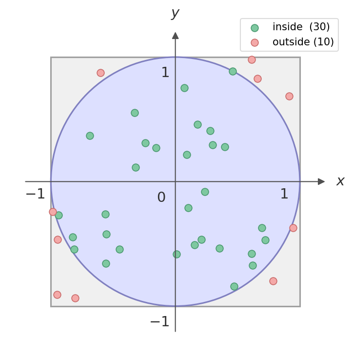

# Estimating $\pi$

In this exercise we will try to estimate the value of $\pi$ numerically.

> every time you want to implement something, it is most likely because you want to answer a question.
> Our question today is:

> **What is $\pi$?**

Before starting to think algorithmically, we want to think scientifically (geometrically?): "what do we know about $\pi$?"

## The Monte Carlo Method

**Monte Carlo** methods are a broad class of algorithms that use repeated random sampling to obtain numerical results. The name comes from the Monte Carlo Casino in Monaco — the connection being randomness and probability.

The core idea is simple: if you can express a quantity as the expected value of some random process, you can estimate it by simulating that process many times and averaging the outcomes.

### Geometric intuition for $\pi$

Consider a circle of radius $r = 1$ centered at the origin, inscribed inside a square of side $2$:

- Area of the circle: $A_\text{circle} = \pi r^2 = \pi$
- Area of the square: $A_\text{square} = (2r)^2 = 4$

Now imagine throwing darts **uniformly at random** onto the square. The probability that a dart lands inside the circle is:

$$P(\text{inside circle}) = \frac{A_\text{circle}}{A_\text{square}} = \frac{\pi}{4}$$

If we throw $N$ darts in total and $M$ of them land inside the circle, then by the law of large numbers:

$$\frac{M}{N} \approx \frac{\pi}{4} \qquad \Longrightarrow \qquad \pi \approx 4 \cdot \frac{M}{N}$$

|  |
| --- |
| Explanatory plot: Area of the square = 4, Area of the circle = $\pi$ |

### How to check if a dart is inside the circle

A point $(x, y)$ is inside the unit circle if and only if:

$$x^2 + y^2 \leq 1$$

So the algorithm is:
1. Draw $x$ and $y$ independently and uniformly from $[-1, 1]$ (or equivalently from $[0, 1]$ using just the first quadrant).
2. Check whether $x^2 + y^2 \leq 1$.
3. Repeat $N$ times, count how many points satisfy the condition ($M$).
4. Estimate $\pi \approx 4 M / N$.

### Convergence and error

The estimate improves as $N$ grows, but slowly: the statistical error scales as $1/\sqrt{N}$. This means that to gain one extra decimal digit of accuracy you need to increase $N$ by a factor of 100. This is a general feature of Monte Carlo methods — they are not the most efficient way to compute $\pi$, but they are a powerful illustration of the principle and scale well to high-dimensional problems where other methods fail.

## Deliverable

### Tier 1 — Bachelor (required)

Implement the Monte Carlo estimate of $\pi$ in a **Jupyter Notebook**:

* Generate $N$ random points inside the square.
* Count how many fall inside the circle and compute $\pi \approx 4M/N$.
* Print or display the result for a few values of $N$ and comment on what you observe.

> **Bonus (still in the notebook):** repeat the experiment $K$ times for the same $N$ and compute the **mean** and **standard deviation** of the estimates across realisations. How does the spread change as $N$ grows?

---

### Tier 2 — Master (required)

Turn the notebook work into a **reusable Python script**:

* Organise the logic into functions (e.g. one function that runs a single experiment, one that aggregates results).
* Use only the Python standard library (`random`, `math`, `sys`, …).
* Make the script executable from the command line, accepting $N$ (and optionally $K$) as arguments.
* Estimate and report the **mean and standard deviation** of $\pi$ over $K$ realisations.

---

### Tier 3 — PhD (required)

Everything in Tier 2, plus:

* Study the convergence of the error as a function of $N$: produce a log-log plot of the standard deviation vs $N$ and verify the expected $1/\sqrt{N}$ scaling.
* Discuss the result: what does this imply for the computational cost of gaining one extra decimal digit of accuracy?

## Hints

* I would test functionalities in a **Jupyter Notebook** or in a **Python shell** (interactive preferably).
  When I am satisfied with what I have learnt, I can copy the relevant commands in the script.

* Do not write a full block of code before testing that it works, it most certanly won't. **GRANULARITY** of functionality testing is essential. 

* The standard python library for random numbers is
  ```python
  import random
  ```
  remember the `dir` command?
  Try to use it to see what functions are contained in the `random` module:
  ```python
  dir(random)
  ```

* Mathematical operations are not only implemented in NumPy, we have a module in the Python Standard Library:
  ```python
  import math
  ```
  note that it is cleaner to import only the functions that you need, e.g.
  ```python
  from math import sqrt
  ```

* We can access system functions with
  ```python
  import sys
  ```
  with wich you can make (e.g.) a script (or an executable) take command line arguments.
  If the script `myscript.py` is
  ```python
  import sys
  print(sys.argv)
  ```
  and I call it with some command line argument (e.g. `42`), I will get:
  ```bash
  $ python myscript.py 42
  [ 'myscript.py', '42' ]
  ```
  so we learn two things:
  * `sys.argv` returns everything that comes after the `python` executable in a list
  * everything is interpreted as a string (like in bash)
  but we can convert it (remember casting?):
  ```python
  argument = int(sys.argv[1])
  ```


